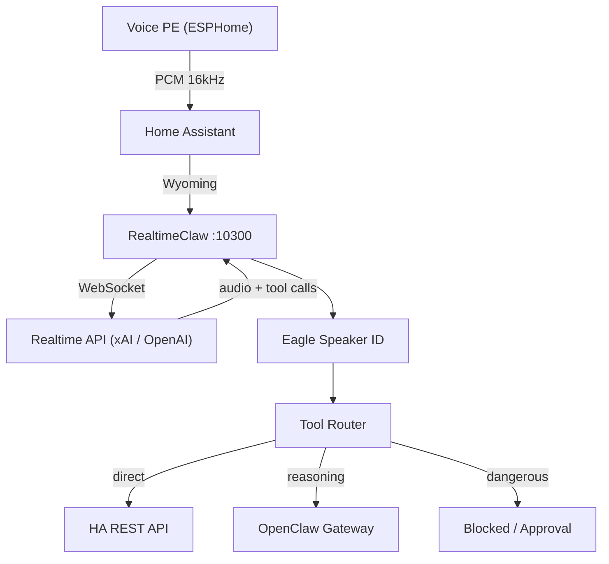
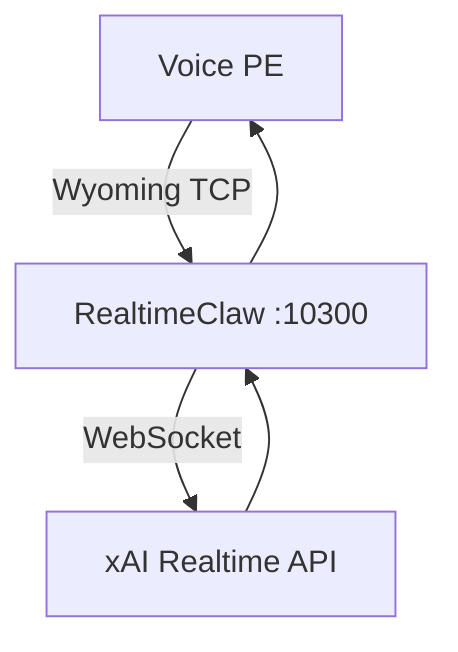
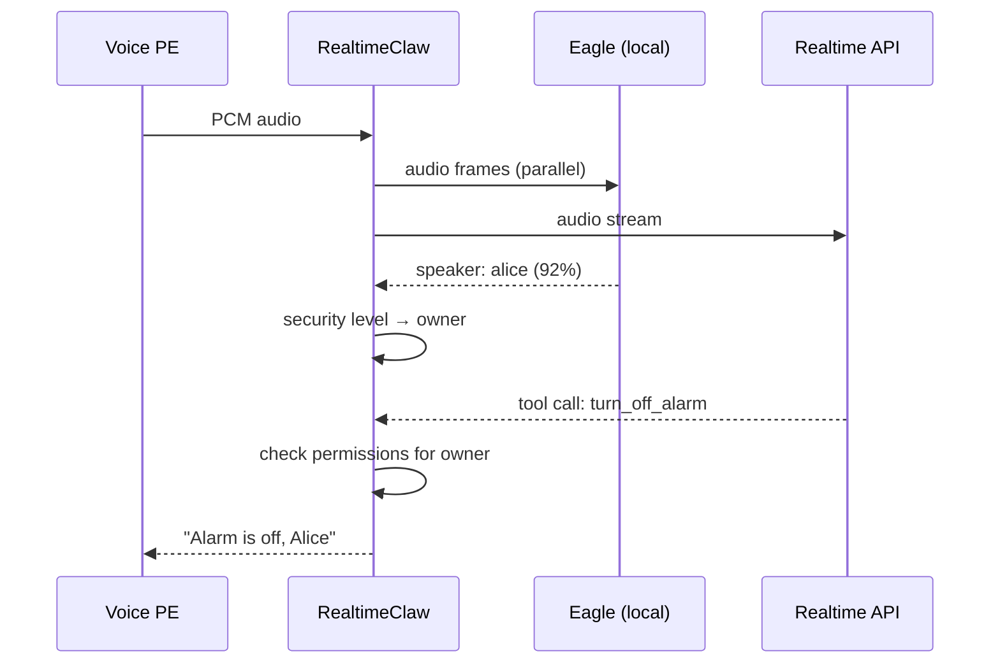
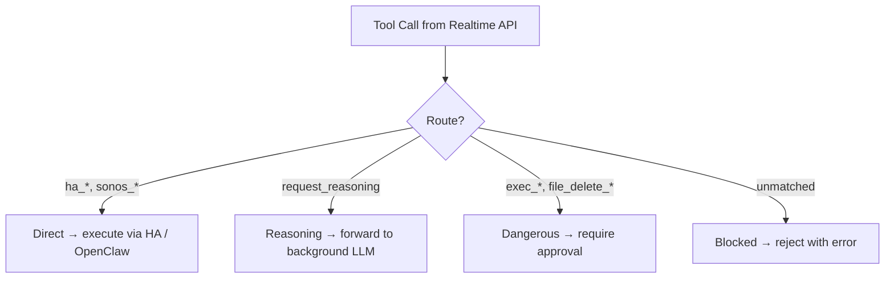
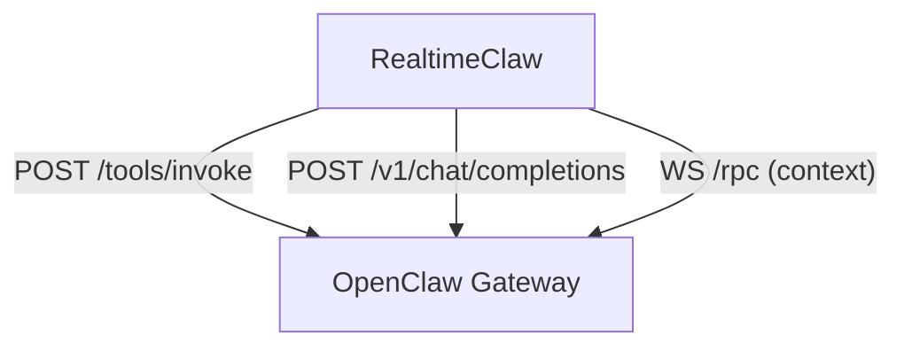

# RealtimeClaw


> [Wyoming Protocol](https://www.home-assistant.io/integrations/wyoming/) to Realtime Speech-to-Speech API bridge for Home Assistant

RealtimeClaw connects Home Assistant voice pipelines to xAI, OpenAI, and Inworld
Realtime Speech-to-Speech APIs over WebSocket. Instead of the traditional
STT → text-LLM → TTS pipeline, audio goes directly to a speech-to-speech model —
delivering sub-1-second voice response latency with local speaker identification
and security-filtered tool routing.

Works standalone with Home Assistant, or paired with
[OpenClaw](https://github.com/openclaw/openclaw) for personality, persistent
memory, and advanced tool skills.

## Architecture



All audio stays PCM 16 kHz S16_LE end to end — no resampling, no transcoding.
One Realtime WebSocket connection is created per Wyoming session and torn down on
disconnect.

### Direct Voice PE Connection

[Voice PE](https://www.home-assistant.io/voice_control/voice_remote_local_assistant/)
satellites can also bypass HA entirely and connect straight to RealtimeClaw using
the bundled ESPHome component in [`firmware/`](./firmware), which speaks Wyoming
Protocol over TCP:



## Prerequisites

- [Home Assistant](https://www.home-assistant.io/) with the [Wyoming integration](https://www.home-assistant.io/integrations/wyoming/)
- An API key from a supported provider — xAI gives $25 free credit at [console.x.ai](https://console.x.ai)
- Optional: [OpenClaw](https://github.com/openclaw/openclaw) for personality, memory, and tool skills
- Optional: [Picovoice](https://picovoice.ai/) access key for speaker identification (free tier: 100 min/month)

## Installation

### Home Assistant Addon (recommended)

1. In HA go to **Settings → Add-ons → Add-on Store**
2. Click **⋮** (top right) → **Repositories**
3. Add: `https://github.com/ufelmann/RealtimeClaw`
4. Find **RealtimeClaw** in the store → **Install**
5. **Configuration** tab → set your **xAI API Key**
6. **Start** → check the **Log** tab

See [addon/DOCS.md](addon/DOCS.md) for full addon documentation.

### Docker

```bash
git clone https://github.com/ufelmann/RealtimeClaw.git
cd RealtimeClaw
cp .env.example .env   # edit with your API key
docker compose up -d
```

### From Source

```bash
git clone https://github.com/ufelmann/RealtimeClaw.git
cd RealtimeClaw
npm install
cp .env.example .env   # edit with your API key
npm run dev
```

### Connect to Home Assistant

1. Go to **Settings → Devices & Services → Add Integration → Wyoming Protocol**
2. Enter the host IP where RealtimeClaw is running, port **10300**
3. Assign the bridge to a Voice PE satellite

## Features

### Multi-Provider Support

All three providers implement the same OpenAI Realtime Protocol. Switch with a
single environment variable:

| Provider | `REALTIME_PROVIDER` | Default Voice | Notes |
|----------|---------------------|---------------|-------|
| xAI      | `xai` (default)     | rex           | PCM, PCMU, PCMA formats |
| OpenAI   | `openai`            | alloy         | PCM only |
| Inworld  | `inworld`           | default       | PCM only |

### Speaker Identification

Picovoice Eagle runs locally to identify speakers from voice audio — no cloud
calls, no recordings leave the device.



- Enroll speakers by voice: *"Jarvis, lerne meine Stimme, ich bin Alice"*
- Confidence threshold configurable (default 0.7)
- Speaker identity feeds into the security model for per-session tool filtering

### Security Model

Each session gets a security level based on speaker confidence and per-speaker
caps. Tools are filtered cumulatively — higher levels include all lower-level
permissions.

| Level    | Confidence   | Example Permissions |
|----------|-------------|---------------------|
| guest    | < 50%       | Lights, music |
| family   | 50 – 70%   | + Climate, own calendar |
| trusted  | 70 – 90%   | + Document titles, all calendars |
| owner    | > 90%       | + Full document access |

Speaker max levels cap access regardless of confidence (e.g., children never
exceed `family`).

### Tool Routing

Function calls from the Realtime API are classified and handled by route:



Configure routes with `TOOL_ROUTE_DIRECT`, `TOOL_ROUTE_REASONING`, and
`TOOL_ROUTE_DANGEROUS` (comma-separated glob patterns).

### OpenClaw Integration

[OpenClaw](https://github.com/openclaw/openclaw) is an open-source AI gateway that
manages your assistant's personality (SOUL.md), user profiles, persistent memory,
and provides tool skills for Home Assistant, Paperless, calendars, and more.
RealtimeClaw connects to OpenClaw for context and tool execution — but works fine
without it (use HA Direct tools + addon config for personality instead).



- **Context**: SOUL.md (personality), IDENTITY.md, USER.md loaded per session
- **Tools**: All OpenClaw skills (ha-ultimate, paperless, calendar) available
- **Reasoning**: Deep reasoning queries forwarded to background LLM with web search
- **Device pairing**: Ed25519 key exchange, auto-reconnect on restart

### Additional Features

- **Audio pacing** — response audio is paced at real-time rate (1024 B / 32 ms) to prevent ESP32 buffer overflow
- **Reconnect with backoff** — exponential backoff with jitter, per-provider retry parameters
- **Latency tracking** — TTFA (Time To First Audio) logged per session
- **Barge-in** — interrupting mid-response cancels the current response immediately
- **Startup verification** — checks all integrations (xAI, HA, OpenClaw, Eagle) at boot
- **Debug mode** — set `DEBUG_REALTIME_CLAW=true` for verbose WebSocket logging

## Configuration

Copy `.env.example` and set at minimum `XAI_API_KEY`:

```bash
cp .env.example .env
```

See [.env.example](.env.example) for the full list of variables with descriptions.

For complex setups, use a JSON config file that overrides environment variables:

```bash
CONFIG_FILE=./config.json realtime-claw
```

See [config.example.json](config.example.json) for the schema.

## Development

```bash
npm install          # install dependencies
npm run dev          # run with tsx (hot reload)
npm test             # run all 251 tests
npm run build        # compile TypeScript
npm run typecheck    # type-check without emitting
npm run lint         # lint src/ and tests/
```

### Project Structure

```
src/
  bridge.ts              # session orchestration, barge-in, tool routing
  config.ts              # env + JSON config loading with validation
  types.ts               # shared type definitions
  wyoming/               # Wyoming Protocol TCP server + binary parser
  realtime/              # WebSocket client, providers, reconnect, latency
  security/              # security levels, permission filtering
  router/                # tool call classification (direct/reasoning/dangerous)
  tools/                 # OpenClaw client, HA direct, reasoning tool
  speaker/               # Eagle speaker ID, enrollment, voiceprint management
  session/               # session flush / memory persistence
tests/                   # vitest: unit + integration (295 tests, 13 E2E)
addon/                   # Home Assistant addon (config, Dockerfile, docs)
firmware/                # ESPHome custom component for direct Voice PE → bridge
  components/            # wyoming_tcp_client C++ / Python component
  example.yaml           # reference ESPHome YAML for a Voice PE
```

## Contributing

See [CONTRIBUTING.md](CONTRIBUTING.md) for guidelines.

## License

MIT — see [LICENSE](LICENSE).
